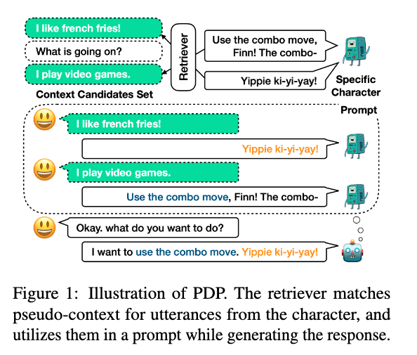
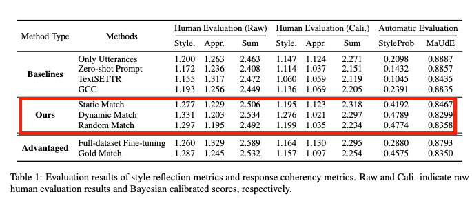

## Meet Your Favorite Character: Open-domain Chatbot Mimicking Fictional Characters with only a Few Utterances

> **# 요약** \
> 가상의 캐릭터의 어조 (character utterance)를 모방하기 위한 프롬프팅 기법 PDP (Psudo Dialog Prompting) 기법 제안. \
> 보다 효과적으로 캐릭터의 어조를 모방하기 위해서 실제 캐릭터의 발언 dialog history를 프롬프트로 구축하여 PDP 기법을 구성하였음. 

# Introduction
> How would you feel if you could talk to your favorite character?

- 최근 연구에서는 open-domain coversation model이 LLM과 함께 놀라운 발전을 보여주고 있음
- 한편, 최근 연구에서는 단순한 잡담에서 open-source conversation model을 더욱 매력적으로 만들기 위해서 실생활 대화의 바람직한 특성을 반영한 몇가지 방향을 제시함.
    - [style-controlling conversation models](#reference) : 대상의 스타일로 응답을 생성함 
    - [persona-grounded conversation models](#reference) : personal description을 활용해서 인격을 유지하며 응답함 
- 해당 연구에서는 fictional character를 모방해서 대화하는 모델을 고려.
- two major challenges applying previous approaches
    1. personal-ground conversation model들 처럼 angry, happy 같이 단순하게 몇가지 설명만으로 fictional character를 정의하는 것이 어려움. 표현력이 부족하다. 
    2. conversation model을 학습시키기에는 fictional character에 대한 충분한 dialog data가 부족하다. 새로운 캐릭터마다 수동으로 모든 데이터셋을 추가하기엔 매우 비효율적.
- 앞선 두가지 challenge를 해결하기 위해서 우리는 fictional charater의 몇가지 발언만으로도 캐릭터를 모방하는 응답을 생성할 수 있는 task 제안. 
- 왜 우리의 것이 정당한가?
    - [가상의 인물의 발화는 특성이나 스타일이 내재되어있기 때문에 모방하는데 유용한 단서를 제공함](#reference). 
    - 오직 대상 캐릭터의 일부 어조만 수집하면 되기 때문에 전반적인 dialog data를 수집하는 것보다 비용면에서 효율적임. 

- PDP (Pseudo Dialog Prompting)이란?
    - pretrained LLM의 힘을 활용함. 몇가지 대상 캐릭터의 발화를 사용하라는 prompt를 구축하고, 캐릭터의 내용을 포함하는 대화형식으로 응답하라는 프롬프트를 디자인함. 
    - 우리는 제안된 task를 위해서 발화만을 사용하기 때문에 관련된 pseudo-context와 매칭하기 위해 retrieval model을 사용하였음. ([매칭을 해서 어디에 사용하는거지?](#Method))

# Method
- $\{u_1, u_2, .., u_k\}$의 k개의 캐릭터의 발화만으로 모방해서 응답하도록 모델링할 것.
- 가장 간단한 방법과 한계 \
    Madotto et al. (2021), PersonaChat(2018) 와 같이 발화 연결. 캐릭터의 스타일을 반영하지 않는 경향이 있음. (section 4) 
    - 해당 원인은 훈련셋에 persona를 포함한 프롬프트형식이 등장할 가능성이 낮기 때문에 활용하지 못하는 것. 
- 해당 연구에서는 이러한 문제를 dialog에서 speaker의 경엔 일관성을 유지한다는 특징을 사용해서 persona를 유지하도록 유도함 (speaker를 일관성의 기준으로 사용한다는게 독특하다.)
- **How to build dialog?**\
    각 utterance $u_i$를 매칭하는 pseudo-context $c_i$가 필요함. 우리는 pseudo-context를 얻기 위해서 Retriever(해당 논문에서는 Bi-encoder를 사용함) 를 사용하였음.
    > **Bi-Encoder?** \
    context c와 response r을 각각 임베딩 공간에 매핑하고 이에 따라 관련성 점수를 계산하도록 학습된 retrieval model
- **building dialog**
    - 우리는 [BST dataset](https://scholar.google.com/scholar_url?url=https://arxiv.org/abs/2004.08449&hl=ko&sa=T&oi=gsr-r&ct=res&cd=0&d=3093108908124733894&ei=Su4tZrieB5Sr6rQP2cCl-Ao&scisig=AFWwaeb2YgkBTcBsqVLNnez_WRVh) (최대 규모의 오픈 도메인 대화 데이터셋)에서 fixed set of single-turn context candidates $C$를 정의
    - retriever R을 사용해서 utterance $u_i$에 매칭되는 pseudo-context $c_i$를 선택함. 
    - pseudo-context $c_i$를 선택하기 위해 Static Match, Dynamic Match, Random Match의 기법을 사용함. (하단 Matching Methods 참고)
    - $(c_i, u_i)$의 k개의 pair는 $e_{ctx}(x) · $e_{resp}(u_i)$ 를 기반으로 오름차순을 매긴 후에 dialog format으로 prompt에 넣는다. 

## Matching Methods
 - **Static Match**\
    retrieval model R을 사용해서 주어진 어조 $u_i$를 일관된 pseudo-context $c_i$로 선택하도록 하는 방법.
    - $u_i$가 주어졌을 때, R은 각 $c \in C$에 대한 $s_{stat}$을 계산함.
    - $S_{stat}(c;u_i) = e_{ctx}(c) · e_{resp}(u_i)$ 
    - static match에서는 argmax값을 pseudo-context로 가정하였음. $c_i = argmax_cs_{stat}(c;u_i)$ 

- **Dynamic Match**\
    $u_i$에 더하여 입력 context $x$와 관련된 pseudo-context c_i를 선택하는 방법, 다양한 input context $x$에 의존하므로 dynamic match로 명명. 

    - $x$와 $u_i$가 주어졌을 때, R는 각 $c \in C$에 대해서 score $s_{sdn}$을 계산함.
    - $s_{dyn}(c;x, u_i) = e_{ctx}(c)· e_{ctx}(x) + s_{stat}(c;u_i)$ 
    - $c_i = argmax_cs_{dyn}(c; s, u_i)$
    - 입력상황을 포함하여 유사한 pseudo-context를 얻는 것으로 persona 반영에 추가로 기여하고자 함. 
- **Random Match**\
    $R$을 사용하지 않고 context candidates set $C$로부터 무작위로 pseudo-context $c_i$를 선택함. 
    

# Experiment
## Evaluation
### Experimental Setting
- [HLA-Chat 데이터셋](https://scholar.google.com/scholar_url?url=https://ojs.aaai.org/index.php/AAAI/article/view/6328&hl=ko&sa=T&oi=gsr-r&ct=res&cd=0&d=7145545100629472474&ei=AQQuZs7gEeDA6rQP5_ClmA0&scisig=AFWwaeYZ8BZKHHY6qUuNvtVOBDpg)을 활용하여 evaluation에 대한 character set을 정의하였음. 
    > **HLA-Chat?** \
    > single-turn dialogs of characters in various TV shows. 
- 모든 캐릭터들 중에서 10명의 캐릭터를 선정하고 각 캐릭터의 고유성을 가장 잘 드러내는 8개의 캐릭터 어조를 수동 선별.
- RQ
    - RQ1. Does the model’s response reflect the style of a given character (주어진 캐릭터의 스타일 반영 여부)
    - RQ2. Does the model respond coherently to the given dialog context? (주어진 dialog context에 대한 관련 반응 여부)
- 두가지 RQ를 조사하기 위해 고정된 dialog context에서 모델을 실행하고, 스타일을 반영하고 대화의 일관성을 나타내는 지표를 계산하였음. 
- dialog context 지표를 위해 DailyDialog의 utterances of the test split 기법을 사용하였음. 

### Human Evaluation
- style이 뚜렷한 5명의 캐릭터 선정.
- fixed context set에서 50개를 샘플링. 
- Amazon MTurk를 사용해서 sample context에 대한 annotation 수집. 
- 평가 기준
    - Style Strength : 주어진 캐릭터의 스타일이 얼마나 강력한가
    - Appropriateness : 응답이 주어진 대화 맥락에 유창하고 적절한가
- 두 평가 기준에 대해서 0-2까지의 척도로 평가. 
- annotator 간의 변동성을 줄이기 위해서 human evaluation score에 bayesian calibration을 적용함. 

### Automatic Evaluation
- StyleProb (classifier의 평균 probability) : HLA-Chat은 class imbalance 이슈가 있어서 style accuracy 대신에 StyleProb을 지표로 사용
- [MaUdE](https://scholar.google.com/scholar_url?url=https://arxiv.org/abs/2005.00583&hl=ko&sa=T&oi=gsr-r&ct=res&cd=0&d=15825586096514160436&ei=MAguZp_yM7eC6rQPxaiC6AY&scisig=AFWwaeaayNj6cupixYFPva_wPatR) : 응답의 일관성에 대한 인간의 판단에 대한 평가지수. 

## Pre-trained Language Model
- 3.8B의 decoder-only transformer를 Base-LM으로 사용함
- conversation에대한 이해와 general language skill을 얻게하기 위해서, [The Pile dataset](https://scholar.google.com/scholar_url?url=https://arxiv.org/abs/2101.00027&hl=ko&sa=T&oi=gsr-r&ct=res&cd=0&d=14307370292644219967&ei=yQguZqCEOYSY6rQPhb-08AY&scisig=AFWwaeY0RLw-682q0Y_nYkyvPIkP)과 public web documents corpus를 추가로 학습시켰음. 

## Baseline Methods
- Only Utterances\
pseudo-context의 효과를 평가하기 위함 
- Zero-shot Prompting \
controlled generation의 효과를 확인하기 위함. 
- TextSETTR\
 plain response를 생성하기 위해서 TextSETTR을 사용하였음
- GCC \
사용자의 이전 발화를 연결해서 사용자의 대화 기록으로 사용자의 페르소나 제어하는 기법. 대화 데이터셋에 대하여 추가 학습이 필요함.  
## Advantaged Methods
- 추가 데이터에도 access 가능하므로 다른 메소드에 불공평할 수 있어 실험 조건을 추가함. 
- **HLA-Chat Full-dataset Fine-tuning**\ 
HLA-Chat 전체 데이터셋에 대한 Base-LM을 fine-tuning. 
- **Gold Match**\
pseudo-context 대신에 character example utterance에 관련된 실제 context를 사용함. 
# Results

- baseline과의 비교 
    - 전반적으로 proposed PDP는 baseline보다 훨씬 나은 반영 점수를 보여주며, 장점이 있는 방법보다 뛰어남. 
    - only utterace에 비해서도 높은 style reflection score를 지님. only utterance prompt가 pseudo-context 유무이므로 대화 형식의 프롬프트를 제공하는 것이 fictional character의 스타일을 반영하는데에 효과적임을 나타냄
- matching method
    - static match가 모든 변형 중 가장 일관적인 응답을 보여줌. 하지만 style reflection 측면에서는 dynamic match의 성능이 조금 더 높다. \
    하지만 synamic match는 일관성이 낮아진 모습을 보임. 
    - 앞선 결과로 static match와 dynamic match의 방법론의 경우, style reflection/consistency 특성 중 어떤 것에 중요도를 주는지에 따라 달라질 것. 
    - random match도 style reflection 측면에서는 상당히 높은 성능을 보여줌. 
- Discussion
    - Gold match
        - PDP보다 style strencth에서 떨어진 성능을 보임. 
        - gold context-response pair가 모든 경우에 적합함이 아님을 확인할 수 있음. 
    - HLA-Chat
        - Gold match 결과와 같이 HLA-Chat의 context-response pair도 스타일 정도와 일관성 측면에서 후속 응답 품질에 부정적인 영향을 미칠 수 있을 것. (실험상으로 실제 성능은 본 기법과 크게 차이가 없음)
    - PDP methods는 다른 베이스라인들과 비교하였을 때 살짝 낮은 response coherency를 보였음. \
    이는 PDP 방식의 $(c_i, u_i)$ pair 내에 불일치가 생겨 모델의 일관성에 부정적인 영향을 미쳤기 때문으로 추정
    - 또한 그림 1의 "Yippie ki-yi-yay!"같은 경우에는 캐릭터의 스타일을 강력하게 반영하다보니 open-domain에 관련이 없어 MaUdE 점수가 감소할 수 있음. 

# Reference
- Style-controlling conversation models
    - [(2020 AAAI) Emotional chatting machine: Emotional conversation generation with internal and external memory](https://scholar.google.com/scholar_url?url=https://ojs.aaai.org/index.php/AAAI/article/view/11325&hl=ko&sa=T&oi=gsr-r&ct=res&cd=0&d=13075172936856719627&ei=CuQtZt7jHouL6rQP09Su8AI&scisig=AFWwaeaz57iK_R0f1d5ajbwM4VRY)
    - [(2020) GoEmotions: A dataset of fine-grained emotions](https://scholar.google.com/scholar_url?url=https://arxiv.org/abs/2005.00547&hl=ko&sa=T&oi=gsr-r&ct=res&cd=0&d=18293641811630363898&ei=KeQtZtiZA5Sr6rQP2cCl-Ao&scisig=AFWwaeZUiw4yzQUTUt96scunh2bi)
    - [(2019)Towards empathetic open-domain conversation models: A new benchmark and dataset](https://scholar.google.com/scholar_url?url=https://arxiv.org/abs/1811.00207&hl=ko&sa=T&oi=gsr-r&ct=res&cd=0&d=7612787438970895110&ei=P-QtZtT5ObeC6rQPxaiC6AY&scisig=AFWwaebpo-DUGxdiobINp04_k3XJ)

- Persona-grounded conversation models
    - [(2018) Personalizing dialogue agents: I have a dog, do you have pets too?](https://scholar.google.com/scholar_url?url=https://arxiv.org/abs/1801.07243&hl=ko&sa=T&oi=gsr-r&ct=res&cd=0&d=3549630893257499646&ei=cuQtZtDyF4uL6rQP09Su8AI&scisig=AFWwaeatVJKTBOs4aT4GIRJ6eIOh)
    - [(2020) Will I sound like me? improving persona consistency in dialogues through pragmatic self-consciousness](https://scholar.google.com/scholar_url?url=https://arxiv.org/abs/2004.05816&hl=ko&sa=T&oi=gsr-r&ct=res&cd=0&d=3139590448298465225&ei=nuQtZraOOJGq6rQP0v6Q2Ac&scisig=AFWwaebZ0Cg8zkyeKiinP8O0nzPE)
    - [(2020) Like hiking? you probably enjoy nature: Persona-grounded dialog with commonsense expansions](https://scholar.google.com/scholar_url?url=https://arxiv.org/abs/2010.03205&hl=ko&sa=T&oi=gsr-r&ct=res&cd=0&d=7946807629798842726&ei=tOQtZriFJODA6rQP5_ClmA0&scisig=AFWwaeYOpAao4jt86iJBaP-JRiXL)

- 캐릭터의 발화에는 어조나 스타일이 내재되어있음
    - [(2020) Large scale multi-actor generative dialog modeling](https://arxiv.org/abs/2005.06114)
    - [(2020) Aloha: Artificial learning of human attributes for dialogue agents](https://ojs.aaai.org/index.php/AAAI/article/view/6328)

    
